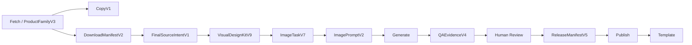

# Architecture

The production factory has one controller and a one-way data flow:



`core/production.py` is the only production controller. Full runs, resume, and
manual `--stages` execution call the same stage handlers. A stage failure is
recovered only by rerunning its failed task and passing that stage's gates.

## Hard Boundaries

- Product plugins own category facts, role policy, preservation rules, and
  template mappings. They do not own provider retry, publishing, or job state.
- Program code makes one final role decision per source from source index,
  source-bound evidence, and deterministic rules. A visual model is used only
  to recover genuinely ambiguous non-primary sources. Every decodable source
  with product, scene, or authored information becomes main, scene, func, or
  size; `review_required` is reserved for unusable evidence.
- ProductFamilyV3, the category contract, and the one editable reference own
  product facts and structure. Gemini owns only one family art direction and
  evidence-bound source creative briefs.
- Size and function roles are reference-image edits. They cannot fall back to
  new-product rendering or local final-image composition.
- QA-lite evaluates hard factual gates only. Human review owns aesthetics,
  composition, family consistency, and other visual judgments, and cannot
  override an explicit hard-fact failure.
- Candidate SHA or task-fingerprint changes invalidate human approval.
- A partial family may publish approved children, but cannot produce a family
  template and exits with code 4.

## Canonical Artifacts

Each current-schema job uses only these production authorities:

```text
job_state.json
source/product_family_v3.json
reports/run_scope_v5.json
reports/copy_v1.json
images/download_manifest_v2.json
reports/final_source_intents_v1.jsonl
reports/visual_design_kits_v9.jsonl
reports/image_tasks_v7.jsonl
reports/image_prompts_v2.jsonl
reports/candidate_manifests/<child>/<role>/<task_fingerprint>/candidate<N>.json  (CandidateManifestV5)
reports/qa_evidence_v4.jsonl
reports/human_review_v4.json
reports/release_manifest_v5.json
reports/production_summary_v3.json
images/_r2_image_urls.csv
```

The final template is generated only after every child is published, every URL
is reachable, copy fingerprints are current, and all required fields pass the
template audit. Template readiness is either `draft` or `submit_ready`; this
project does not claim Amazon acceptance before an active SP-API submission.

## Job Lifecycle

- Job protocol is `6.0`; `job_state.json` schema is `7`. Jobs whose protocol or
  state schema is not current are refused and must be recreated; there is no
  production migration path.
- Exit `0`: the requested debug stages completed, or every child was published
  and the final production template was generated.
- Exit `1`: fatal configuration/model/data/stage failure, or another
  non-complete `pending` result.
- Exit `2`: job lock conflict.
- Exit `3`: automatic QA complete and awaiting human review.
- Exit `4`: useful work completed but the family remains partial; approved
  sibling images may already be published, but no submit-ready template exists.

Old-schema jobs are rejected on resume. They are not scanned, migrated, or
modified. Create a new job so current schemas and fingerprints are established
from the source.
